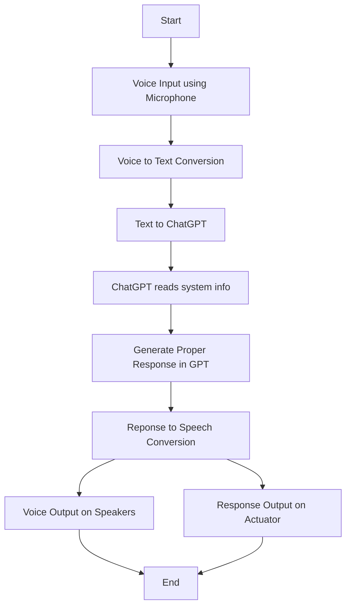

**Embedded-GPT**

**Table of Contents**
<!-- TOC -->

- [Introduction](#introduction)
- [Algorithm](#algorithm)
- [To-Do](#to-do)
- [Designer Details](#designer-details)
- [License](#license)

<!-- /TOC -->

# Introduction
This is a GPT-based project which aims at creating an embedded board with a microphone, speaker and internet as add-ons to interact with robots with voice and get responses in terms of voice/visual feedback. This is still in development and is not tested completely. This is completely ***open-source*** for anyone to use.

# Algorithm

# To-Do

- [ ] Build Proof of Concept on Desktop Environment using Python:
  - [ ] Speech-to-Text Conversion using Google API
  - [ ] Send Converted Text to ChatGPT API
  - [ ] Fetch the Response from ChatGPT
  - [ ] Text-to-Speech Conversion
  - [ ] Integrate GPT To Read System Data
- [ ] Improve efficiency by switching to C++
- [ ] Select an embedded platform to implement the code on
- [ ] Improve efficiency for the specific embedded platform

# Designer Details

Designed by: [Parth Patel](mailto:parth.pmech@gmail.com)

# License

This project is licensed under [GNU General Public License v3.0](https://www.gnu.org/licenses/gpl-3.0.en.html) (see [LICENSE.md](LICENSE.md)).

Copyright 2023 Parth Patel

Licensed under the GNU General Public License, Version 3.0 (the "License"); you may not use this file except in compliance with the License.

You may obtain a copy of the License at

_https://www.gnu.org/licenses/gpl-3.0.en.html_

Unless required by applicable law or agreed to in writing, software distributed under the License is distributed on an "AS IS" BASIS, WITHOUT WARRANTIES OR CONDITIONS OF ANY KIND, either express or implied. See the License for the specific language governing permissions and limitations under the License.
